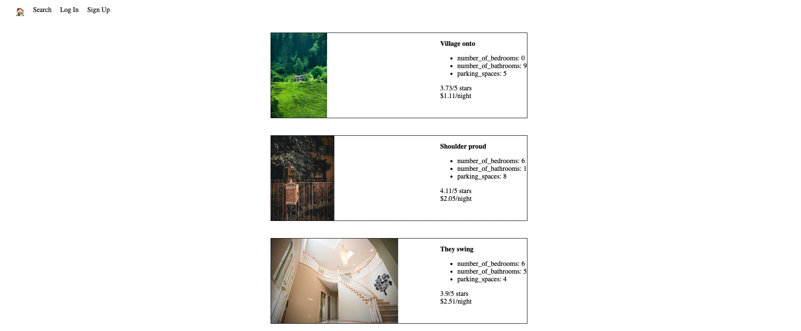
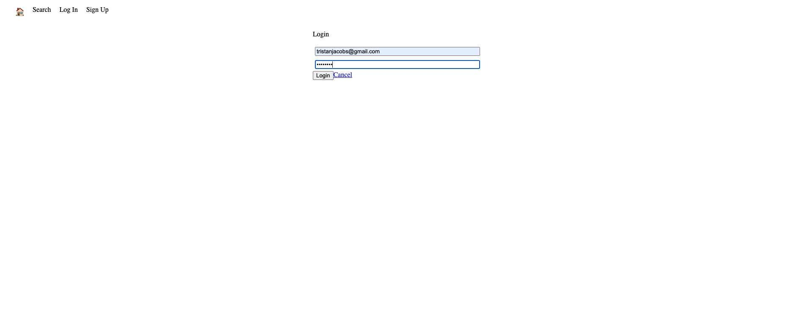
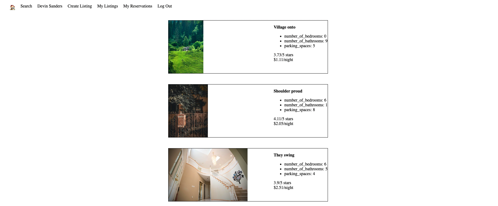
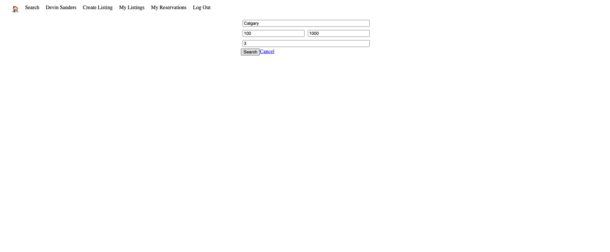
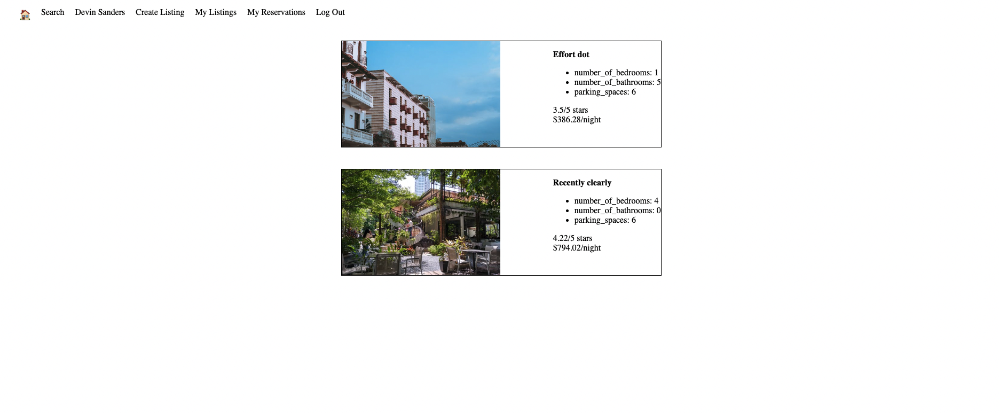
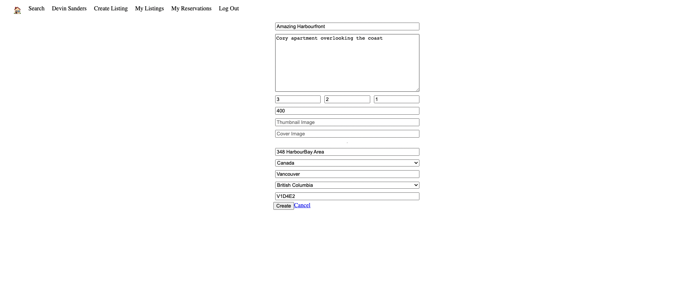
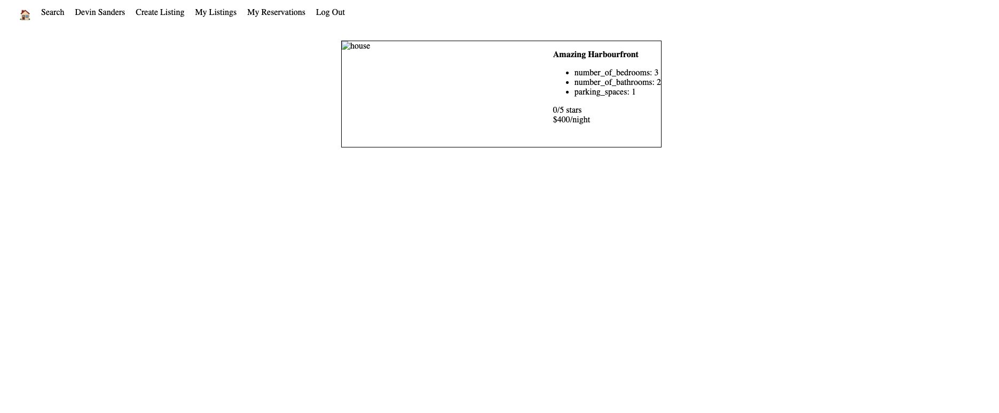
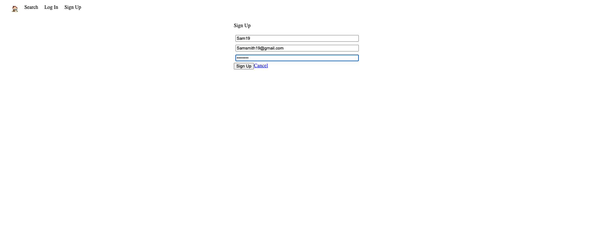
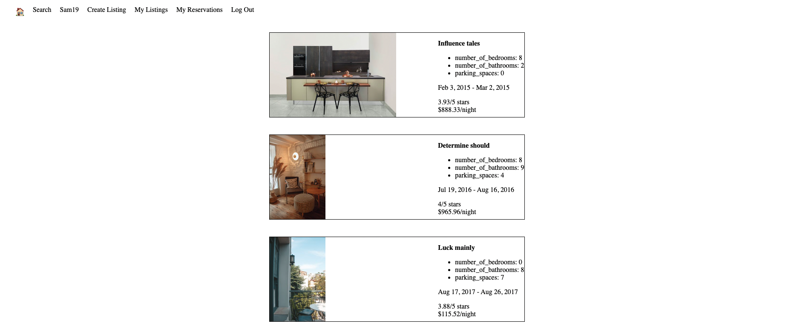

# LightBnB

LightBnB, an a revolutionary web application for the travel industry that will allow home owners to rent out their homes to people on vacation, creating an alternative to hotels and bed and breakfasts.

## Getting Started

1. Create a new repository using this repository as a template.
2. Clone your repository onto your local device.
Go to PSQL, create an database named lightbnb and use follow as login info:
- user: "vagrant",
- password: "123",
- host: "localhost",
- database: "lightbnb"
3. Run schema and seeds in PSQL by using following code:
- \i migrations/01_schema.sql
- \i seeds/01_seeds.sql
- \i seeds/02_seeds.sql
4. Cd into LightBnB_WebApp-master folder
5. Install dependencies using the `npm install` command.
6. Start the web server using the `npm run local` command. The app will be served at <http://localhost:3000/>.
7. Go to <http://localhost:3000/> in your browser.

## Dependencies

- bcrypt
- body-parser
- cookie-session
- express
- nodemon
- pg

## Final Product

### Landing Page

### Login Page

### Main Page After Logging In

### Search for Properties

### Search Results

### Existing Reservations Page

### Create New Listing

### Newly Created Listing Page

### Sign Up Page

### Landing Page After Successfully Sign Up

